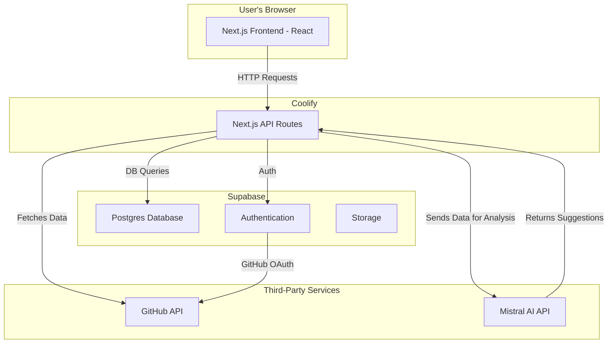

# Technical Implementation: Lookas

This document outlines the technical architecture and implementation details for the Lookas project. It builds upon the [Project Overview](./01-project-overview.md).

---

### **1. System Architecture**

The system is designed as a modern web application leveraging the Next.js framework for both the frontend and backend, with Supabase providing the database and authentication services.



**Workflow:**

1.  **Authentication**: The user connects their GitHub account using Supabase Auth, which handles the OAuth2 flow with GitHub. Access tokens are securely stored in the Supabase database.
2.  **Data Fetching**: Next.js API routes periodically fetch data from the GitHub API (using the user's token). To manage rate limits, we will use GraphQL for efficient data fetching and utilize webhooks where possible for real-time updates. Data is then transformed and stored in our Postgres database.
3.  **Frontend**: The Next.js/React frontend fetches data from our own API routes, which in turn query the Supabase database. This keeps our GitHub API usage efficient and centralized.
4.  **AI Analysis**: The backend sends aggregated, anonymized metrics to the Mistral AI API and receives actionable suggestions, which are then displayed on the dashboard.

---

### **2. Database Schema (Supabase/Postgres)**

We will use a relational database to store information about users, organizations, repositories, and their associated activities.

**Tables:**

-   `users`: Stores user information and their encrypted GitHub access tokens.
-   `organizations`: Links users to the GitHub organizations they belong to.
-   `repositories`: Stores information about the repositories selected for tracking.
-   `pull_requests`: Caches PR data (author, status, created/merged timestamps, reviewers).
-   `issues`: Caches issue data (assignees, labels, status, timestamps).
-   `commits`: Stores commit history for trend analysis.
-   `ai_suggestions`: Stores suggestions generated by the AI to avoid re-generating them on every page load.

---

### **3. Backend Implementation (Next.js API Routes)**

The backend logic will reside in Next.js API routes.

**Key Endpoints:**

-   `api/auth/*`: Handled by Supabase Auth helpers for login, logout, and session management.
-   `api/github/sync`: An endpoint to trigger a manual or scheduled data sync from GitHub. This will fetch data for all tracked repositories.
-   `api/metrics/{repoId}/{metric}`: Dynamic endpoints to serve aggregated metrics for the frontend (e.g., `api/metrics/123/pr-activity`). Data will be read from our database, not directly from GitHub on each request.
-   `api/ai/generate-suggestions`: An endpoint that compiles relevant metrics, sends them to the Mistral AI API, and stores the response in the `ai_suggestions` table.

**Handling Challenges:**

-   **API Rate Limiting:**
    -   Use the GitHub GraphQL API to fetch only the data we need in a single request.
    -   Implement intelligent caching on our API routes.
    -   Use GitHub Webhooks to receive real-time updates for events like PR creation or merges, reducing the need for constant polling.
-   **Data Privacy:**
    -   GitHub access tokens will be encrypted at rest in the database using `pgsodium`.
    -   All communication will be over HTTPS.
    -   We will only request the minimum required permissions from the user's GitHub account.

---

### **4. AI Integration (Mistral AI)**

The AI integration will focus on providing actionable insights from the collected data.

-   **Input Data**: We will send structured JSON data to the Mistral AI API, containing summaries like: "3 PRs open for >14 days," "Contributor 'X' has 50% of their assigned issues overdue," etc.
-   **Prompt Engineering**: Prompts will be carefully crafted to be role-specific. For example: `As a project manager, analyze the following repository metrics and provide three concrete suggestions to improve team velocity and code quality.`
-   **Output**: The AI's text response will be parsed and displayed in a dedicated "Suggestions" widget on the dashboard.

---

### **5. Frontend Implementation (Next.js & Tailwind CSS)**

The frontend will be a responsive and interactive single-page application.

-   **Component Library**: We will use a headless component library like Radix UI, styled with Tailwind CSS, to build accessible and reusable UI elements (modals, dropdowns, etc.).
-   **Data Fetching & State Management**: We'll use a library like SWR or React Query to handle data fetching from our backend API. This provides caching, revalidation, and a better user experience.
-   **Charts & Visualizations**: A library like **Recharts** or **Chart.js** will be used to render the interactive charts for metrics visualization.
-   **Directory Structure**:
    ```
    src/
    ├── app/                # Next.js App Router
    │   ├── (auth)/         # Auth-related pages (login)
    │   └── (dashboard)/    # Protected dashboard routes
    │       ├── layout.tsx
    │       └── page.tsx
    ├── components/         # Reusable UI components
    │   ├── charts/
    │   ├── layout/
    │   └── ui/             # Buttons, inputs, etc.
    ├── lib/                # Helper functions, constants
    └── services/           # API fetching logic
    ```

---

### **6. Development & Deployment**

-   **Package Manager**: `pnpm` will be used for its efficiency with disk space and installation speed.
-   **Linting/Formatting**: ESLint and Prettier will be configured to maintain code quality and consistency.
-   **Deployment**: The application will be deployed on Coolify (a self-hosted Netlify alternative), which provides seamless integration with Next.js, CI/CD, and serverless functions for API routes.
-   **Database**: Supabase will host our Postgres database and handle authentication.
